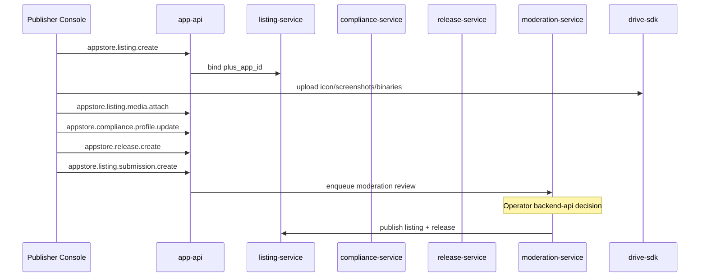
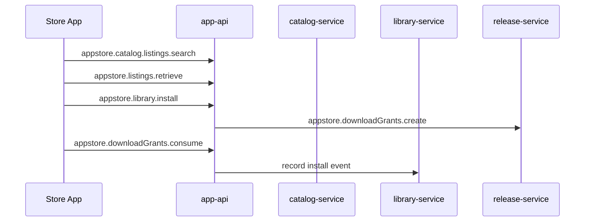
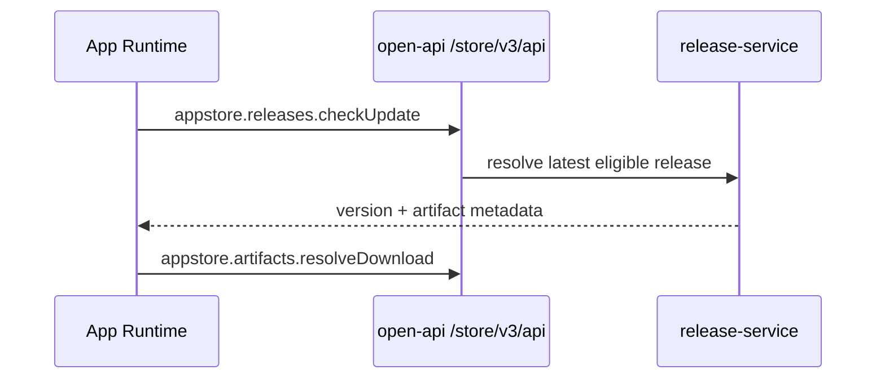

# SDKWork App Store Architecture

Version: 0.1.0  
Status: foundation design  
Related: ADR-20260612-appstore-foundation, REQ-2026-appstore-foundation

## 1. Product Positioning

SDKWork App Store is the **ecosystem marketplace backend** for discovering, publishing, reviewing, distributing, and updating SDKWork applications across PC, H5, mobile native, desktop, and mini-program surfaces.

It intentionally mirrors industry store separation:

| Industry pattern | SDKWork mapping |
| --- | --- |
| App Store Connect / Play Console | Publisher + listing + release APIs (app-api) |
| App Store / Play Store storefront | Catalog + listing detail + library (app-api) |
| App Review / Play policy review | Moderation + compliance (backend-api) |
| TestFlight / internal testing tracks | Release channels + rollout (app-api + open-api) |
| App Store Connect API / Play Developer API | Open API update + artifact resolve |
| Library / My Apps | User library + wishlist |

## 2. Layered Architecture

```text
┌─────────────────────────────────────────────────────────────�?
�?Client apps (apps/* �?external process)                     �?
�? UI �?service �?sdkwork-appstore-*-sdk + dependency SDKs    �?
└───────────────────────────┬─────────────────────────────────�?
                            �?HTTPS
┌───────────────────────────▼─────────────────────────────────�?
�?sdkwork-appstore-standalone-gateway                                   �?
�? mounts sdkwork-routes-*-{app,backend,open}-api crates      �?
└───────────────────────────┬─────────────────────────────────�?
                            �?
┌───────────────────────────▼─────────────────────────────────�?
�?sdkwork-appstore-service-host                                 �?
�? publisher | listing | release | catalog | library            �?
�? moderation | compliance | analytics projection ports         �?
└───────────────┬─────────────────────────────┬─────────────────�?
                �?                            �?
     ┌──────────▼──────────�?      ┌──────────▼──────────�?
     �?appstore-    �?      �?External SDK ports  �?
     �?repository-sqlx     �?      �?IAM / Drive /       �?
     �?                    �?      �?Comments / Commerce �?
     └──────────┬──────────�?      └─────────────────────�?
                �?
     ┌──────────▼──────────�?
     �?SQLite / PostgreSQL �?
     └─────────────────────�?
```

### Layer rules

- Route crates adapt HTTP only; no business rules.
- Services enforce invariants and orchestrate ports.
- Repositories implement SQLx persistence against `appstore_*` tables.
- Cross-domain calls go through generated SDK clients or declared ports �?never direct foreign table writes.

## 3. Capability Modules

### 3.1 Publisher (`appstore_publisher*`)

**Purpose:** Developer identity inside a tenant organization.

**Key states:** `publisher_status`, `verification_status`

**Apple/Google alignment:** Developer Program enrollment, Play Console developer account.

**Service:** `sdkwork-appstore-publisher-service`

### 3.2 Listing (`appstore_listing*`)

**Purpose:** Public store metadata bound to a registered PlusApp.

**Key states:** `listing_status`, `storefront_visibility`, `review_status`

**Workflow:** draft �?submitted �?in_review �?approved �?published �?delisted

**Apple/Google alignment:** App information, store listing, localized metadata, categories.

**Service:** `sdkwork-appstore-listing-service`

### 3.3 Release (`appstore_release*`)

**Purpose:** Versioned distributable builds per channel and platform.

**Key states:** `release_status`, `rollout_status`, `artifact_status`

**Apple/Google alignment:** Version/build numbers, phased release, platform binaries.

**Service:** `sdkwork-appstore-release-service`

### 3.4 Catalog (`appstore_catalog*`)

**Purpose:** Discovery surfaces �?categories, collections, featured, charts.

**Apple/Google alignment:** Today/Collections, Top Charts, featured placements.

**Service:** `sdkwork-appstore-catalog-service`

**Note:** Search index may later integrate intelligence/search domain; phase 1 uses DB + snapshot rankings.

### 3.5 Library (`appstore_user_*`, install events, download grants)

**Purpose:** Per-user ownership/install state and controlled artifact delivery.

**Apple/Google alignment:** Purchased apps library, install/update telemetry, secure download URLs.

**Service:** `sdkwork-appstore-library-service`

### 3.6 Moderation (`appstore_moderation*`, submissions)

**Purpose:** Operator review of listing/release submissions.

**Apple/Google alignment:** App Review queue, rejection reasons, policy citations.

**Service:** `sdkwork-appstore-moderation-service`

### 3.7 Compliance (`appstore_compliance*`)

**Purpose:** Privacy nutrition, content rating, permission disclosures.

**Apple/Google alignment:** Privacy labels, Data safety, content rating questionnaire.

**Service:** `sdkwork-appstore-compliance-service`

### 3.8 Analytics (`appstore_*_metric*`, chart snapshots)

**Purpose:** Read models for publisher and operator dashboards.

**Worker:** `sdkwork-appstore-analytics-worker`

## 4. Core Workflows

### 4.1 Publish flow (publisher)



### 4.2 Install flow (end user)



### 4.3 Update check (client runtime)



## 5. Security Model

| Surface | Auth | Notes |
| --- | --- | --- |
| app-api | Dual-token (AuthToken + AccessToken) | Tenant + organization scope |
| backend-api | Dual-token + backend permissions | Operator roles: `appstore.moderation.*`, `appstore.catalog.admin.*` |
| open-api | API key or signed client credential | Update clients, CI publish automation |

Sensitive operations (L3):

- Moderation decisions (immutable audit)
- Download grant issuance and consumption
- Publisher verification approval

## 6. Crate Map (implementation phase)

| Crate | Responsibility |
| --- | --- |
| `sdkwork-appstore-standalone-gateway` | HTTP server process |
| `sdkwork-appstore-service-host` | In-process service wiring |
| `sdkwork-appstore-publisher-service` | Publisher use cases |
| `sdkwork-appstore-listing-service` | Listing use cases |
| `sdkwork-appstore-release-service` | Release/artifact/grants |
| `sdkwork-appstore-catalog-service` | Catalog/collections/charts |
| `sdkwork-appstore-library-service` | Library/wishlist/install |
| `sdkwork-appstore-moderation-service` | Review queue/decisions |
| `sdkwork-appstore-compliance-service` | Compliance profiles |
| `sdkwork-appstore-repository-sqlx` | SQLx repositories |
| `sdkwork-appstore-analytics-worker` | Metric/chart projection |
| `sdkwork-routes-*-{surface}` | Route manifests per capability |

## 7. Deployment Modes

Following `DEPLOYMENT_SPEC.md`:

| Mode | Backend | Notes |
| --- | --- | --- |
| SaaS | Java Spring (target) | Shared multi-tenant store |
| Local/private | Rust + SQLite/PostgreSQL | Same API paths and contracts |
| Desktop embedded | Rust service-host in Tauri host | Optional future packaging |

## 8. Frontend Boundary

All store UI packages consume:

- `sdkwork-appstore-app-sdk` for storefront and publisher console flows
- `sdkwork-appstore-backend-sdk` for operator admin only
- Dependency SDKs for auth, comments, drive uploads

No raw HTTP from UI components (`FRONTEND_SPEC.md`).

## 9. Phase Plan

| Phase | Deliverable |
| --- | --- |
| **Phase 0 (current)** | Database, architecture, API, SDK design contracts |
| **Phase 1** | Rust route crates + services + repository + OpenAPI materialization |
| **Phase 2** | SDK generation + contract tests |
| Phase 3 | Java SaaS parity for core publish/browse/install (deferred) |
| Phase 4 | Commerce paid apps, advanced search, recommendation |

## 10. Related Documents

- `docs/api/operation-catalog.md`
- `docs/sdk/sdk-design.md`
- `specs/database/schema-registry.yaml`
- `apis/app-api/store/openapi.yaml`
- `apis/backend-api/store/openapi.yaml`
- `apis/open-api/store/openapi.yaml`
