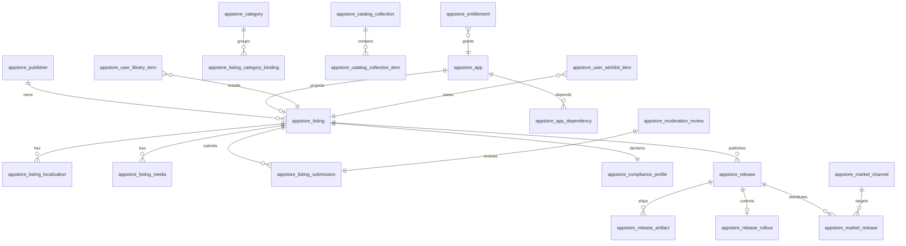

# appstore Database Registry

Portable data contracts for `sdkwork-appstore`. Compliance target: **L2** (L3 for moderation audit and download grants).

## Module Prefix

| Prefix | Owner | Domain |
| --- | --- | --- |
| `appstore_` | sdkwork-appstore | appstore, extending standard ecosystem |

## Serialization

| Logical type | API/SDK expression |
| --- | --- |
| int64 | string |
| decimal | string |
| instant | ISO-8601 UTC |
| enum | string token |

## Entity Groups

## Table Catalog

| Table | Profile | Write owner | Description |
| --- | --- | --- | --- |
| `appstore_idempotency_key` | control | store-api | Idempotent command deduplication |
| `appstore_publisher` | master | publisher-service | Developer/publisher account |
| `appstore_publisher_member` | master | publisher-service | Publisher team membership |
| `appstore_publisher_verification` | master | publisher-service | Business/developer verification |
| `appstore_app` | master | app-service | SDKWork App Store application fact source |
| `appstore_app_dependency` | relation | app-service | App dependency and compatibility metadata |
| `appstore_category` | master | catalog-service | Store taxonomy node |
| `appstore_tag` | master | catalog-service | Faceted tag dictionary |
| `appstore_listing` | master | listing-service | Store listing bound to PlusApp |
| `appstore_listing_localization` | master | listing-service | Locale-specific listing copy |
| `appstore_listing_media` | master | listing-service | Icon/screenshot/video references |
| `appstore_listing_category_binding` | relation | listing-service | Listing-to-category mapping |
| `appstore_listing_tag_binding` | relation | listing-service | Listing-to-tag mapping |
| `appstore_listing_submission` | workflow | listing-service | Submission/review pipeline state |
| `appstore_compliance_profile` | master | compliance-service | Privacy/content rating snapshot |
| `appstore_compliance_permission_disclosure` | master | compliance-service | Declared app permissions |
| `appstore_release` | master | release-service | Version/build metadata |
| `appstore_release_note_localization` | master | release-service | Release notes per locale |
| `appstore_release_artifact` | master | release-service | Platform install package metadata |
| `appstore_release_rollout` | master | release-service | Staged rollout configuration |
| `appstore_release_channel` | master | release-service | Production/beta/internal channels |
| `appstore_market_channel` | master | distribution-service | SDKWork and external store channel metadata |
| `appstore_market_release` | workflow | distribution-service | Per-channel release status and rollout |
| `appstore_regional_availability` | master | listing-service | Territory availability matrix |
| `appstore_moderation_review` | workflow | moderation-service | Operator review task |
| `appstore_moderation_decision` | audit_event | moderation-service | Immutable review decision |
| `appstore_catalog_collection` | master | catalog-service | Editorial collection |
| `appstore_catalog_collection_item` | relation | catalog-service | Collection membership |
| `appstore_catalog_featured_slot` | master | catalog-service | Featured placement schedule |
| `appstore_catalog_chart_snapshot` | read_model | analytics-worker | Daily chart rankings |
| `appstore_user_library_item` | master | library-service | Installed/owned listing for user |
| `appstore_user_wishlist_item` | master | library-service | Saved listing for user |
| `appstore_entitlement` | master | entitlement-service | Subject-level install/use/update grants |
| `appstore_download_grant` | ledger_event | release-service | Time-bound download authorization |
| `appstore_install_event` | audit_event | library-service | Install/update/uninstall facts |
| `appstore_listing_metric_snapshot` | read_model | analytics-worker | Daily listing metrics |

## Cross-Domain References

| Field | External owner | Rule |
| --- | --- | --- |
| `plus_app_id` | platform / PlusApp | Stable app registration identity |
| `plus_app_key` | platform manifest | Immutable `app.key` from manifest |
| `comments_thread_id` | sdkwork-comments | Review thread binding |
| `drive_node_id` | sdkwork-drive | Binary and media storage |
| `media_resource_id` | drive/media | Public DTO projection |
| `commerce_product_id` | sdkwork-commerce (deleted) | Paid listing linkage (optional) |

## Index Strategy

- All tenant-scoped list queries: `(tenant_id, organization_id, <status or sort>, created_at DESC)`
- Public catalog browse: `(tenant_id, listing_status, storefront_visibility, published_at DESC)`
- User library: `(tenant_id, user_id, library_status, updated_at DESC)`
- Update check: `(tenant_id, plus_app_key, channel_code, platform, architecture)`
- Moderation queue: `(tenant_id, review_status, priority, submitted_at ASC)`

## Migration Source

Authoritative DDL: `migrations/0001_appstore_foundation.sql`

Any schema change must update this registry first, then add a forward migration.
